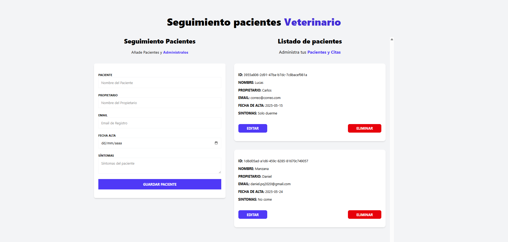

# 🐾 Seguimiento de Pacientes Veterinarios

[](https://app.netlify.com/sites/control-veterinario2025/deploys)

🚀 **Proyecto desarrollado con React: Seguimiento de Pacientes Veterinarios**

Este proyecto permite gestionar el registro y seguimiento de pacientes en una clínica veterinaria, proporcionando un formulario para ingresar los datos de los pacientes y ofreciendo funcionalidades para crear, editar, visualizar y eliminar registros.

## 🌐 [Live Demo](https://control-veterinario2025.netlify.app/)

---

## 💡 Descripción

La aplicación ofrece un sistema completo para llevar el control de los pacientes ingresados en la clínica veterinaria. A través de un formulario intuitivo, se pueden registrar datos, editar información, visualizar el historial y eliminar registros de manera rápida y eficiente.

### ⚙️ Funcionalidades

| Funcionalidad                                      | Descripción                                               |
|----------------------------------------------------|-----------------------------------------------------------|
| ✅ Registro de pacientes                            | Utiliza un formulario intuitivo para capturar datos.       |
| ✅ Edición y eliminación de registros                | Gestiona la información directamente desde la interfaz.    |
| ✅ Almacenamiento persistente                        | Guarda los datos en `localStorage` o `sessionStorage` usando Zustand Persist. |
| ✅ Gestión del estado global con Zustand             | Define acciones para crear, editar, mostrar y eliminar pacientes. |
| ✅ Notificaciones personalizadas con React-Toastify | Mejora la experiencia del usuario con mensajes claros.     |

---

## 🛠️ Tecnologías Utilizadas

- **React**: Biblioteca principal para el desarrollo de la interfaz.
- **React-Hook-Form**: Simplificación de formularios con validación integrada.
- **Zustand**: Gestión de estado global y almacenamiento persistente.
- **Zustand Persist**: Almacenamiento en `localStorage` o `sessionStorage`.
- **React-Toastify**: Notificaciones personalizadas para mejorar la UX.
- **Tailwind CSS**: Estilos modernos y personalizables.
- **TypeScript**: Tipado estático para mayor robustez.

---

## 📸 Vista Previa



---

## 💻 Instalación y Uso

Clona el repositorio:
   ```bash
   -git clone https://github.com/tu-usuario/control-veterinario.git
   -cd control-veterinario
   ```
Instala las dependencias:
   ```bash
   -npm install
   ```
Inicia la aplicación en modo desarrollo:
   ```bash
   -npm run dev
  ```
Abre la aplicación en tu navegador:
   ```bash
   -http://localhost:5173
  ```
🌟 Contribuciones
¡Las contribuciones son bienvenidas! Si encuentras algún problema o tienes alguna sugerencia, no dudes en abrir un issue o enviar un pull request.


# 🐾 Veterinary Patient Tracking

[](https://app.netlify.com/sites/control-veterinario2025/deploys)

🚀 **React Project: Veterinary Patient Tracking**

This project helps manage the registration and tracking of veterinary patients, providing a form to enter patient data and offering features to create, edit, view, and delete records.

## 🌐 [Live Demo](https://control-veterinario2025.netlify.app/)

---

## 💡 Description

The application offers a complete system to track the patients admitted to the veterinary clinic. Through an intuitive form, you can register data, edit information, view the history, and delete records efficiently.

### ⚙️ Features

| Feature                                           | Description                                               |
|---------------------------------------------------|-----------------------------------------------------------|
| ✅ Patient registration                            | Uses an intuitive form to capture patient data.            |
| ✅ Edit and delete records                         | Manage patient information directly from the interface.    |
| ✅ Persistent storage                              | Saves data in `localStorage` or `sessionStorage` using Zustand Persist. |
| ✅ Global state management with Zustand             | Defines actions to create, edit, view, and delete patients. |
| ✅ Custom notifications with React-Toastify         | Enhances user experience with clear messages.              |

---

## 🛠️ Technologies Used

- **React**: Main library for building the user interface.
- **React-Hook-Form**: Simplifies forms with built-in validation.
- **Zustand**: Global state management with persistence.
- **Zustand Persist**: Stores data in `localStorage` or `sessionStorage`.
- **React-Toastify**: Custom notifications to improve UX.
- **Tailwind CSS**: Modern and customizable styling.
- **TypeScript**: Static typing for increased robustness.

---

## 📸 Preview


---

## 💻 Installation and Usage

  Clone the repository:
   ```bash
   git clone https://github.com/your-username/veterinary-control.git
   cd veterinary-control
   ```
   Install dependencies:
   ```bash
   npm install
   ```
   Start the development server:
   ```bash
   npm run dev
   ```
   Open the application in your browser:
   ```bash
     http://localhost:5173
   ```

🌟 Contributions
Contributions are welcome! If you find any issues or have suggestions, feel free to open an issue or submit a pull request.
